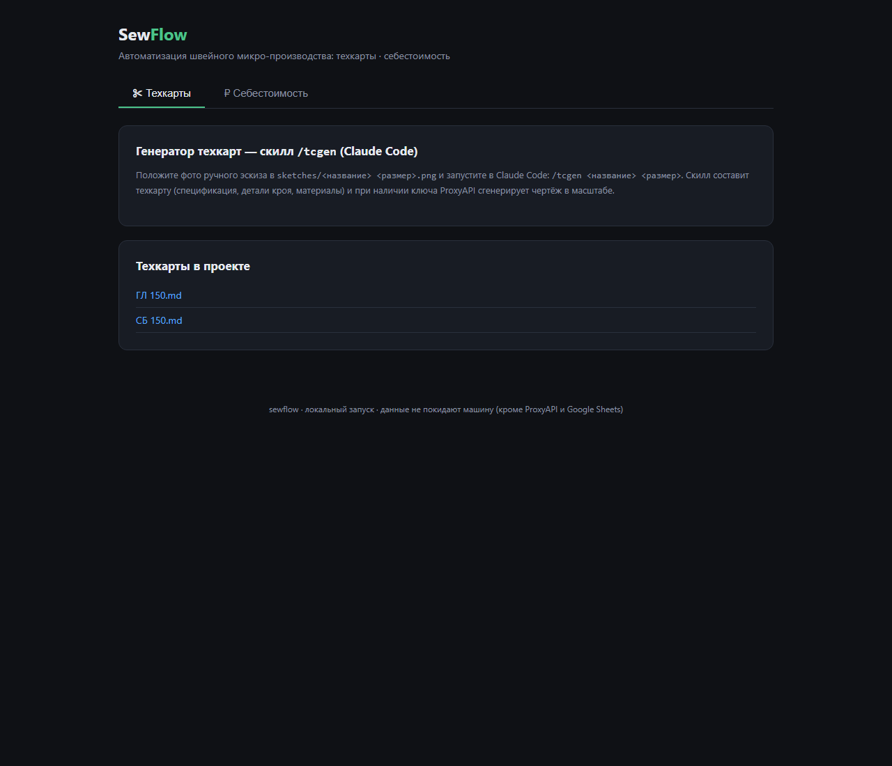
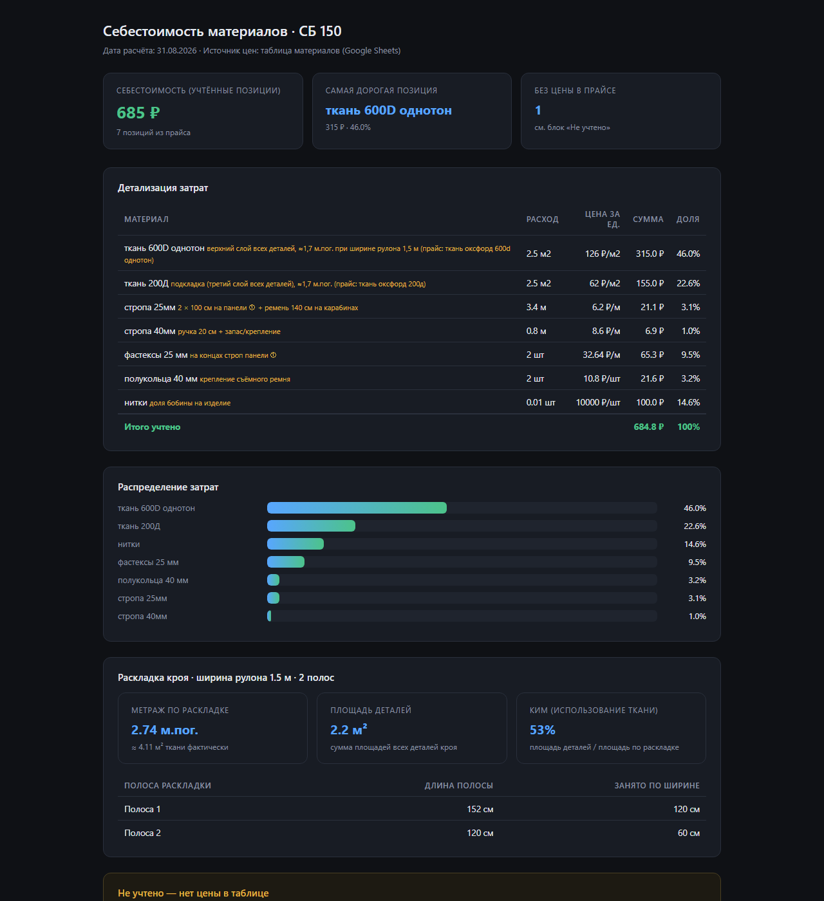

# SewFlow — автоматизация швейного микро-производства

> Учебный выпускной проект: реальная задача действующего производства
> чехлов для сноубордов и горных лыж.

## Проблема

На небольшом швейном предприятии два ключевых процесса делаются вручную:
подготовка техкарт для швей и расчёт себестоимости материалов. Это медленно,
приводит к ошибкам и отвлекает от продукта и продаж.

## Пользователь

Предприниматель — владелец микро-производства, который сам ведёт продукт. Подойдёт любому
мелкому швейному производству: сумки, чехлы, спортивные аксессуары.

## Основная функция

Два модуля в одном локальном веб-интерфейсе:

1. **Генератор техкарт** (скилл `/tcgen` в Claude Code) — на вход: фото ручного
   эскиза из `sketches/`, название и размер изделия; на выходе: производственная
   техкарта в markdown (спецификация, детали кроя, материалы — расположение
   деталей сохраняется как на эскизе, пропорции приводятся к реальным размерам)
   + чистый чертёж в масштабе через ProxyAPI (gpt-image-2).
2. **Калькулятор себестоимости** — на вход: техкарта из `tech_maps/` +
   таблица цен на материалы (Google Sheets); на выходе: расход и стоимость
   каждого материала, полная себестоимость изделия. Ширина рулона (`FABRIC_WIDTH`)
   учитывается автоматически: по таблице «Детали кроя» строится полочная
   раскладка (FFD) — метраж в м.пог., фактические м² и КИМ (доля использования
   ткани) выводятся отдельным блоком дашборда.

Связка: техкарта → себестоимость = полный цикл «от эскиза до ценника».

## Формат результата

- техкарта (`tech_maps/*.md`) — готовый документ для цеха;
- HTML-дашборд себестоимости (`cost_reports/*.html`) — таблица затрат,
  доли позиций, диаграмма, блок «не учтено».

## Минимальный функционал (MVP)

- локальный веб-интерфейс (тёмная тема): генерация техкарт + расчёт себестоимости;
- конфигурация через `.env`, рабочие данные в `tech_maps/` и `cost_reports/`;
- скилл Claude Code `tkcost` (`.claude/skills/tkcost/`) — расчёт себестоимости
  прямо из Claude Code.

**Планируется:** расчёт технологических операций и норм времени, генерация
изображений для карточек товаров, интеграция с 1С.

## Технологии

Python 3.12 · Flask (веб-интерфейс) · requests (API) · python-dotenv (конфиг) ·
ProxyAPI / gpt-image-2 (генерация чертежей) · Google Sheets CSV export (прайс) ·
HTML/CSS отчёты · Claude Code skills (`tcgen`, `tkcost`).

## Запуск

```bash
git clone <url-репозитория>
cd sewflow
pip install -r requirements.txt
copy .env.example .env   # заполнить PROXYAPI_KEY и MATERIALS_PRICE_SHEET
python app.py            # → http://127.0.0.1:5000
```

CLI-режим:

```bash
python -m modules.costing SB-146.md   # расчёт себестоимости
```

## Скриншоты

| Главный экран | Дашборд себестоимости | Чертёж из ручного эскиза (tcgen + gpt-image-2) |
|---|---|---|
|  |  |  |

## Скиллы Claude Code

- `.claude/skills/tcgen/` — генерация техкарты по ручному эскизу:
  `/tcgen <название> <размер>` (эскиз из `sketches/<название> <размер>.png`).
- `.claude/skills/tkcost/` — расчёт себестоимости по техкарте:
  `/tkcost <модель> <размер>`. Скилл сам находит техкарту, тянет прайс
  из Google Sheets (ссылка — в `.env`) и сохраняет HTML-дашборд.
- `.claude/skills/sewops/` — сопровождение репозитория: структура проекта,
  правила запуска, правок, обновления README, чек-лист ошибок и публикации.

## Структура

```
sewflow/
├─ app.py                     # веб-интерфейс (Flask)
├─ modules/costing.py         # калькулятор себестоимости
├─ templates/index.html       # UI (тёмная тема)
├─ .claude/skills/            # tcgen, tkcost, sewops
├─ sketches/                  # ручные эскизы (вход tcgen)
├─ tech_maps/                 # техкарты (md) + чертежи (png)
├─ cost_reports/              # дашборды себестоимости (html)
├─ screenshots/
└─ .env.example
```
